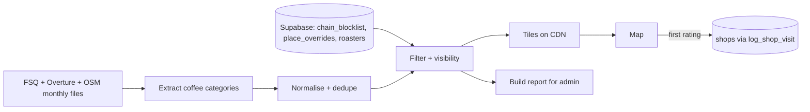

# Coffee SNOB — Curation System Spec

Sep 25, 2026 · @Ethan Maxey

## 1. Summary: keep today's flow, upgrade each step

Coffee SNOB already has the right shape: open data shows every café, a user's rating pulls a shop into our own database and its city, logs build the shop's standing, and a human grants Snob-Approved. This v2 spec keeps that flow and fixes its three weak points: the open-data layer misses shops and shows too many non-specialty ones, chains are removed by hand, and "clout" is a single threshold trigger.

**The flow, today and after this spec:**

| Step | Today | After |
| --- | --- | --- |
| 1. Discover | Live Overpass (OSM only) per map viewport, filtered by `isCoffeePlace` + `isChain` | A prebuilt **coffee index**: FSQ + Overture + OSM merged monthly, filtered, lightly scored, served as static tiles from a CDN. Overpass removed. |
| 2. Enter our DB | First log via `log_shop_visit` creates a `shops` row with `external_id` and city fields | Unchanged. Index entries carry a stable id so a shop keeps its identity across monthly rebuilds. |
| 3. Build clout | `check_shop_promotion` flags at 5 logs averaging 4.2+ | A **clout score** (confidence-adjusted rating, distinct loggers, recency) with visible tiers. |
| 4. Snob-Approved | `shop_curations` row, two human visits | Unchanged. Admin gets a ranked leads list instead of a flat "flagged" filter. |
| Chains | Hand-added to `chain_blocklist`, NSI lookup at `/admin/shops` | Index build auto-flags likely chains. You approve them with one click into the same table. |

**The core rule: our database only holds shops people have engaged with.** Unrated candidates live in the index, not in Postgres. That keeps Supabase small forever and avoids a second identity table.

**Instructions to Claude Code**

1. Read `CLAUDE.md`, `apps/web/CURATION-STANDARDS.md`, `docs/superpowers/specs/2026-09-03-map-community-shops-design.md` and `docs/superpowers/specs/2026-09-23-map-browse-and-search-design.md` first. This spec extends them.
2. Follow repo conventions: migrations from `0027_…`, RLS on every new table (public read, `is_admin()` writes), queries in `packages/supabase`, Vitest, pnpm + Turborepo, a spec and plan in `docs/superpowers/` per phase, a Status line in `docs/v1-launch-tracker.md`.
3. New code goes in one package, `packages/coffee-index` (TypeScript, Node ≥ 20). No other new services.
4. Build in the phase order of section 6. Each phase ships on its own and is reversible.
5. Tunables (thresholds, weights, keyword lists) live in one versioned config file. Secrets only in CI.
6. Ask before adding any paid service or non-permissive dependency.

## 2. What the review cut, and why

The first draft of this spec rebuilt the whole system in parallel. These parts were removed or simplified:

| Cut or changed | Why |
| --- | --- |
| `places`, `place_sources`, `source_places` tables | Duplicated `shops` as a second identity. Candidates now live in the index file, and only rated shops enter Postgres, as today. |
| `signals`, `place_decisions`, `place_attributes` tables | Heavy append-only tables for a small team. Scores are recomputed each build from the sources plus one small overrides table. |
| Per-city bbox imports and `pipeline_status` coverage | Created seams at city edges. One global build covers everywhere at once, which also matches your "shop gets added to its city" model: cities stay a view over `shops.city_key`. |
| Generic roaster stockist crawler | Most stockist pages are JS widgets, so a crawler would mostly fail. Replaced with a paste-a-list admin form. |
| Website crawler and LLM classifier | Rewarded marketing over coffee, and a local LLM can't run on CI runners. Moved to "maybe later". |
| Trust levels, attribute confirmations, submissions table | Premature. User flags and suggestions reuse existing log and admin patterns. |
| Auto-listing at score ≥ 80, 95% precision CI gate | The index shouldn't claim "specialty". It only decides show, dim or hide. Users' ratings decide the rest. |
| Separate review queue app | Folded into the existing `/admin/shops` page as new tabs. |

## 3. Data sources and licensing

Three free open datasets feed the index. Two more feed the chain filter. Paid APIs (Google Places, Yelp, TripAdvisor) stay out because their terms forbid storing data.

| Source | Role | License | How |
| --- | --- | --- | --- |
| Foursquare OS Places | Main coverage, fills OSM gaps | Apache 2.0 | Monthly Parquet |
| Overture Maps Places | Cross-confirmation, stable GERS ids, confidence score | CDLA Permissive 2.0 | Monthly GeoParquet, read with DuckDB |
| OpenStreetMap | Tags your filters already use (`cuisine`, `brand:wikidata`, `opening_hours`) | ODbL | Monthly planet extract of cafés, not live Overpass |
| Name Suggestion Index | Candidate chains, with Wikidata ids | BSD-3 | Already used by your `/admin/shops` lookup |
| Wikidata | Chain resolution by id | CC0 | Already used via `brand:wikidata` |
| Roaster stockist lists | Strong specialty signal | Facts only | Pasted in by you at `/admin/roasters` |

**Candidate categories:** FSQ "Coffee Shop" and "Café"; Overture `coffee_shop` and `cafe`; OSM `amenity=cafe` or a `cuisine` containing `coffee_shop`, the same rule as today's `buildOverpassQuery`.

**Licensing, the simple way.** OSM is ODbL. The index merges OSM with other data and is served publicly, so treat the index as an ODbL database from day one. Credit "© OpenStreetMap contributors" and the other sources on a Data sources screen, and publish the monthly index file for download. Your own content is kept separate and stays yours: ratings, logs, clout, write-ups and Snob-Approvals. This costs nothing, because the index is public anyway, and it removes the per-field provenance tracking the first draft needed. Have this reviewed once by someone who knows ODbL before launch.

## 4. The coffee index (replaces live Overpass)

Once a month, one GitHub Actions job builds a global, deduped, filtered list of coffee places and publishes it as static map tiles. The map reads tiles from a CDN instead of calling Overpass. Supabase is not involved except for reading chains, overrides and roasters.

### 4.1 Build steps

1. **Extract.** DuckDB reads each source's remote Parquet once and keeps only coffee categories worldwide. The output is one small Parquet file per source, cached between runs. Per-city scans are never needed.
2. **Normalise.** Use the shared `normalizeChainName`, `isCoffeePlace` and `isChain` (moved from `apps/web/lib/nearby-shops.ts` into `packages/coffee-index`, and imported back by the web app).
3. **Dedupe.** Cluster places within 50 m. Merge only when names are near-identical, or names are similar *and* the website domain or phone matches. When unsure, keep both: two dots are better than one wrong merge. Field priority: OSM for hours and tags, FSQ and Overture for names and addresses, most recent wins ties.
4. **Filter.** Drop non-coffee (`isCoffeePlace`), chains (`isChain` against `chain_blocklist`), places marked permanently closed, and anything with a `hide` override.
5. **Visibility.** Give each place `show`, `dim` or `hide` (section 5.1).
6. **Publish.** Write gzipped JSON tiles on the same grid step the app already uses in `snapToGrid` (`apps/app/lib/map/bounds.ts`), so a viewport maps to a few tile URLs. Upload to a public Supabase Storage bucket or a free Cloudflare R2 bucket. Old tiles stay until the new set is complete, then a small `manifest.json` switches versions atomically.
7. **Report.** Write a build report: counts by country, changes since last build, and suggested chains. The job fails, and keeps last month's tiles, if more than 10% of places vanish or appear at once.

### 4.2 Stable identity (the thing that must not break)

A shop's id must survive monthly rebuilds, because `shops.external_id` points at it once someone logs a visit.

- Each index entry gets `id = cs_<hash>`, based on its Overture GERS id when present, else its FSQ id, else its OSM id.
- The build keeps an `id_map` from the previous run. A new cluster that contains any source id seen before inherits that old `cs_` id.
- Each entry lists all its source ids. Existing `shops.external_id` values like `node/123` keep working: the map already hides an index dot that duplicates a rated pin, and now matches on any source id, not just OSM.
- New logs send `cs_<hash>` as `p_external_id`. `log_shop_visit` needs no signature change.

### 4.3 What each tile entry holds

`id`, `source_ids`, `name`, `lat`, `lng`, `address`, `locality`, `region`, `country_code`, `website`, `phone`, `hours`, `visibility`, and `why`: a short list of the reasons it's shown, such as "serves Roaster X" or "in 3 sources". Hours, website and phone feed the existing shop screen, which `log_shop_visit` already accepts.

### 4.4 Serving

- **Viewport:** the app fetches tile URLs directly from the CDN. The `nearby-shops` route and its in-memory cache go away.
- **Name search:** the current search sends a wide box plus `?q=` to Overpass. Replace it with a per-country name file (id, name, lat, lng) loaded on first search and filtered on the device. Rated shops keep coming from `shop_ratings`, as now.
- **Fast hides between builds:** a small public view, `active_place_hides`, lists places hidden since the last build (user-reported closures, your overrides). The app fetches it once per session and drops those ids from the tiles.

## 5. Visibility, chains and clout

The index only decides how loudly an unrated place appears. Specialty status is earned from our users' ratings and, at the top, from your two visits.

### 5.1 Visibility for unrated places

A few points, all in the config file. **Show** at 2 or more points, otherwise **dim**. The algorithm never hides a place on its own; hiding comes only from filters, overrides and user flags.

| Signal | Points |
| --- | --- |
| Serves a roaster on your `roasters` list | +3 |
| Is a listed roaster's own café | +3 |
| Found in 2 or more sources | +1 |
| Primary category is coffee shop, not generic café, bakery or restaurant | +1 |
| Has opening hours or a website | +1 |
| Each distinct user "not specialty" flag | −1, cap −3 |
| `show` override | always show |

Each entry's `why` lists the signals that fired, so the app can explain every dot.

### 5.2 Roasters (manual, high value)

- New table `roasters`: `id`, `name`, `website`, `country_code`, `notes`.
- New table `roaster_stockists`: `roaster_id`, `raw_name`, `raw_address`, `matched_id` (a `cs_` id or null), `added_at`.
- `/admin/roasters`: paste a roaster's stockist list as text. The next build matches each line to an index place by name plus address, and the admin shows unmatched lines to fix by hand.
- Start with the roasters you already trust in your launch cities. This is the highest-signal input, matching "local standing" in `CURATION-STANDARDS.md`.

### 5.3 Chains (less manual work)

- Keep `chain_blocklist`, the NSI lookup and `is_chain_name()` as they are.
- Add `status` (`blocked` or `allowed`, default `blocked`) so you can record "not a chain" decisions. `is_chain_name()` and `isChain` only match `blocked` rows.
- Each build's report lists **suggested chains**: names with more than 10 locations in one country, plus NSI coffee brands found in the index, that have no decision yet. On `/admin/shops` each has two buttons: Block or Allow. This replaces hunting for chains on the map.
- Add one shared test fixture of names that runs against both `isChain` (TypeScript) and `is_chain_name()` (SQL), so the twins can't drift.

### 5.4 Clout (replaces the single promotion threshold)

Clout replaces the fixed 5 logs / 4.2 average check in `check_shop_promotion`. It stays a per-shop update on each log insert, as today, written into a small `shop_clout` table instead of recomputed in the `shop_ratings` view.

- **Adjusted rating** = (5 × global average + sum of ratings) ÷ (5 + number of ratings). A shop with two 5-star logs no longer outranks one with forty 4.6s.
- Count **distinct loggers**, using each person's latest rating for a shop. Ten logs from one fan count once.
- Logs older than 18 months count half. Logs from accounts under 7 days old don't count toward tiers.

| Tier | Rule (config) | What users see |
| --- | --- | --- |
| Candidate | In the index, never rated | Small dot, dim or normal |
| Rated | 1+ log | Pin with rating, added to its city page |
| Local favourite | 3+ distinct loggers, adjusted ≥ 4.0 | Badge |
| Rising | 8+ distinct loggers, adjusted ≥ 4.3 | Badge; sets `promotion_status = 'flagged'` as a Snob-Approval lead |
| Snob-Approved | `shop_curations` row after two visits | Existing Snob-Approved pin and write-up |

`promotion_status = 'rejected'` keeps working: the shop can still be Rising for users, but it never re-enters your leads list.

## 6. Admin, users, scale and build plan

### 6.1 Admin: new tabs on `/admin/shops`

- **Leads:** Rising shops ranked by clout, only once their first log is 90+ days old. Each has a two-visit checklist stored in a new `curation_visits` table (`shop_id`, `visited_on`, `notes`). Approving still writes `shop_curations`, as today.
- **Suggested chains:** from the latest build report. Block or Allow.
- **Flags:** user reports grouped by place, with Hide, Dismiss and Open buttons.
- **Possibly closed:** rated shops whose source ids vanished from every source for two builds. Rated shops are never hidden automatically; you decide.
- **Build report:** counts, changes, and failures from the last run.
- `/admin/roasters` sits next to it (section 5.2).

**Two new small tables:** `place_overrides` (`place_id`, `action` show or hide, `reason`, `created_by`, `created_at`) and `place_flags` (`place_id`, `user_id`, `kind` closed / not\_specialty / wrong\_location, `created_at`, unique per user, place and kind). Flags need a signed-in, active account and are rate-limited per user.

### 6.2 For users

- **Quiet candidates.** Unrated dots are small and plain; dim ones appear only when zoomed in. Rated pins, tier badges and Snob-Approved pins stay visually dominant, protecting the "five to ten per city" promise.
- **"Why it's here"** under each candidate, from its `why` list.
- **One-tap reports:** closed, not specialty, wrong location. Two distinct "closed" reports hide the place right away through `active_place_hides`, pending your review.
- **Add a missing shop** from the log flow: drop a pin and name it. It's logged with `external_id = user/<uuid>`, so it enters `shops` and its city on the first rating, as today. The next build matches it to an index place when one appears and saves that link.
- **Credit the finder.** When a shop someone added or first rated becomes Rising or Snob-Approved, tell them.
- **Data sources screen** with attribution and the index month.

### 6.3 Scaling and failure modes

| Risk | Handling |
| --- | --- |
| Map traffic grows 100× | Tiles are static files on a CDN; cost barely moves and Supabase isn't touched. |
| Database growth | Only rated shops and their logs are stored. `shop_clout` replaces per-query aggregation; add a stored `is_chain` flag to `shops` when `shop_ratings` slows. |
| Build time | Coffee-only extracts are cached, so monthly runs stay short. The build is one command and can move off GitHub Actions unchanged. |
| A bad build | Atomic manifest switch, the 10% change alarm, and last month's tiles kept. |
| Losing `id_map` | Stored beside the tiles and versioned; the build refuses to run without it after the first run. |
| Wrong merges in dense areas | Conservative rule; admin can split with an override. |
| Closures | Two user reports hide within minutes; source disappearance catches the rest monthly. |
| Owner gaming | Distinct-logger counting, new-account exclusion, flags rate-limited, and Snob-Approval stays human. |

### 6.4 Build plan (phases for Claude Code)

1. **Phase 0 — Groundwork.** Phase spec in `docs/superpowers/specs/`. Move `normalizeChainName`, `isChain`, `isCoffeePlace` into `packages/coffee-index` with their tests. Add the shared TS/SQL chain fixture test. Add the Data sources screen.
2. **Phase 1 — Build the index.** Extract, normalise, dedupe, filter, visibility, tiles, report and `id_map`. Run it and inspect a pilot city's output. Nothing user-facing yet.
3. **Phase 2 — Serve it.** Map reads tiles behind a feature flag. Compare against Overpass in one city, then remove the Overpass route. Add the per-country search file and `cs_` ids in `log_shop_visit` calls.
4. **Phase 3 — Controls.** `chain_blocklist.status`, the Suggested chains tab, `place_overrides`, `place_flags`, `active_place_hides`, the Flags tab, and in-app reports.
5. **Phase 4 — Clout.** `shop_clout`, tiers and badges, replace the fixed thresholds in `check_shop_promotion`, the Leads tab and `curation_visits`.
6. **Phase 5 — Roasters.** Tables, `/admin/roasters`, stockist matching in the build.
7. **Phase 6 — Freshness.** Possibly-closed tab, missing-shop matching, finder notifications.

**Maybe later, only if the data shows a need:** website signals, an LLM classifier, owner claims.

**Every phase ends with:** reversible migrations, passing tests, updated config docs, and a Status line in `docs/v1-launch-tracker.md`.

### 6.5 Open questions

- [ ] Is treating the index as ODbL acceptable? Get one review before Phase 2.
- [ ] Tile hosting: Supabase Storage bucket or Cloudflare R2?
- [ ] Tier names and thresholds (Local favourite, Rising) — they should sound like the brand voice in `PRODUCT.md`.
- [ ] Should dim candidates show at all, or only on a "show everything" toggle?
